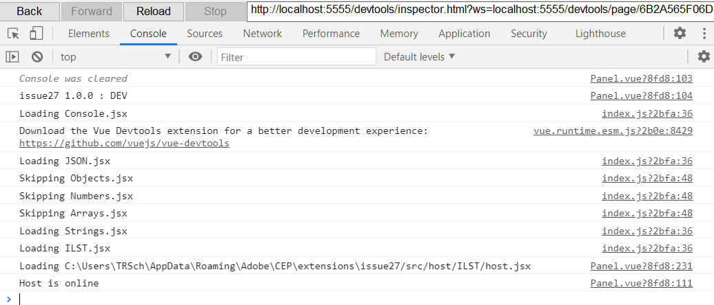
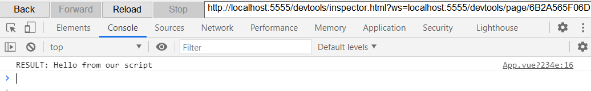

# Issue 27

This turns out to be a problem with conflicting dependencies again, though more specifically to do with my admittedly liberal (and I realize now to be careless) use of "@latest" in package.json values which it turns out has the lowest installation priority over any other syntax like `^1.0.0` or `~1.0.0` and can be very easily out-prioritized in lieu of older versions of packages.

To solve this for an existing panel, we need to forcibly update any bombino required dependencies:

```bash
npm i brutalism@2.3.2 cep-spy@1.3.4 cluecumber@0.1.1 gehenna@1.1.4 starlette@1.0.7
```

The issue described where it appeared to be silent failure from Erik was actually caused by a specific version of `<Panel>` in brutalism, which had been internally referencing `evalScript` from `workaround` instead of `cluecumber`. During the `<Panel>` mounting lifecycle it was essentially disregarding the utilities and scripting files due to using the wrong function.

### This repo is an updated version which should work exactly as expected (along with any new bombino template generated as of now).

## App.vue:

```html
<template>
  <div id="app">
    <Menus refresh debug />
    <Panel>
      <button block @click="testScript">Test script</button>
    </Panel>
  </div>
</template>

<script>
  import { evalScript } from "brutalism";
  export default {
    methods: {
      async testScript() {
        let result = await evalScript("testJSX()");
        console.log("RESULT:", result);
      },
    },
  };
</script>
```

As noted, the ./src/host/[appName]/[file].jsx scripts were not being preloaded, causing the above button to not do anything.

## host.jsx (tested in ILST):

```js
console.log("Host is online");

function testJSX() {
  alert("I'm finally working!");
  return "Hello from our script";
}
```

## Gehenna pre-loading now properly working, verified in console:



## Scripting call now properly working (alert does work, not shown):


